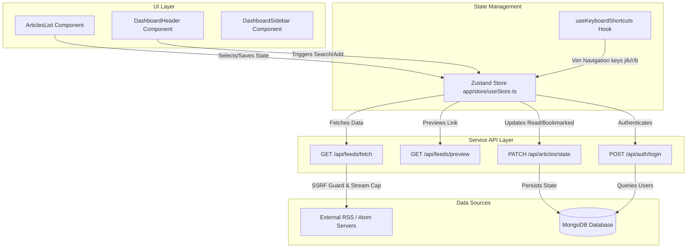

# Frontpage: Portfolio-Grade RSS & Atom Feed Reader

A production-ready, highly performance-optimized RSS/Atom feed reader built with **Next.js**, **Zustand**, and **TanStack Virtual**. Features multi-layer test coverage, strict security sandbox guidelines (SSRF prevention), keyboard navigation, and CSS-driven viewport transitions.

---

## 🏗️ Architectural Flow & Connections

This application follows a unidirectional data flow from component rendering to API services and state management.



---

## 🛠️ Technology Stack & Engineering Rationale

Here are the core technologies utilized in this project and why they were chosen over standard alternatives:

| Technology | Role | Rationale |
|---|---|---|
| **Next.js (App Router)** | Framework | Provides full-stack capabilities with React Server Components (RSCs), edge-compatible API routes, built-in security middleware, and optimal static page generation. |
| **Zustand** | Global State | A lightweight (less than 2kB), subscription-based state manager. Chosen over Redux to avoid boilerplate, and over React Context to prevent unnecessary parent-child re-renders on rapid article changes. |
| **TanStack Virtual** | DOM Virtualization | Headless virtual scrolling library. Instantly scales timeline performance by rendering only the visible viewport nodes (~15 items in the DOM) regardless of whether a feed contains 50 or 5,000 articles. |
| **Vitest** | Test Runner | Native ESM and TypeScript support with out-of-the-box support for Next.js aliases. Significantly faster execution times than Jest by running test files concurrently in isolated processes. |
| **MSW (Mock Service Worker)** | Network Mocking | Intercepts outbound HTTP fetch requests at the network level. Allows the feed-fetch tests to reliably simulate latency (504), heavy bodies (413), and malformed XML without hitting real endpoints. |
| **Tailwind CSS** | Styling | Utility-first styling framework optimized for highly responsive layouts, unified theme custom properties, and performance-tuned glassmorphism states. |

---

## 📁 Project Structure

```bash
├── __tests__/                     # Complete automated test suite
│   ├── api/                       # API Integration tests (Auth, Feeds)
│   ├── components/                # React component tests (Header, Article List)
│   ├── hooks/                     # Custom hook integration tests
│   └── lib/                       # Utility unit tests (SSRF validation, parsing)
├── app/                           
│   ├── api/                       # Next.js API Routes
│   │   ├── auth/                  # Register, Login, Logout, Session endpoints
│   │   └── feeds/                 # SSRF-guarded feed fetchers and previews
│   ├── components/                # Shared layout components (Auth modals, skeleton loaders)
│   ├── config/                    # MongoDB connections and setup
│   ├── dashboard/                 # Main full-screen client workspace
│   │   ├── components/            # Timeline, reader pane, sidebar navigation
│   │   └── hooks/                 # Keyboard shortcuts and workspace listeners
│   ├── store/                     # Zustand store definition
│   └── globals.css                # CSS custom utility classes and entry point
├── components/                    # Low-level visual UI widgets (buttons, dropdowns)
├── utils/                         # Cryptography, password, and email utilities
├── vitest.config.ts               # Vitest runner configuration
└── vitest.setup.ts                # Global mock configurations (localStorage, browser APIs)
```

---

## 🔒 SSRF (Server-Side Request Forgery) Sandbox Guard

To prevent attackers from utilizing the backend server as a proxy to attack internal networks or query cloud metadata endpoints, the `/api/feeds/fetch` route runs under a strict security sandbox:

1. **Bare IP Checks**: Regex filters out common private range formats immediately.
2. **DNS Resolution**: The server resolves host domains using `dns.promises.lookup`.
3. **Loopback/Reserved Ranges Blocked**: Every resolved IP address is verified against private networks (`10.0.0.0/8`, `192.168.0.0/16`, `172.16.0.0/12`, `169.254.169.254`, `::1`). If a match is found, the connection is instantly aborted.

---

## ⌨️ Keyboard Shortcuts (Power User UX)

Shortcuts are globally mapped via the custom React hook `useKeyboardShortcuts.ts` and will ignore triggers if the user's focus is currently inside a search input or text area:

* `j` or `ArrowDown` - Move selection to the next article
* `k` or `ArrowUp` - Move selection to the previous article
* `r` - Toggle the **Read / Unread** state of the selected article
* `b` - Toggle the **Bookmarked** state of the selected article
* `v` - Open the original article link in a new browser tab
* `/` - Clear search and focus the feed search input instantly

---

## ⚙️ Setup and Verification

### 1. Installation
Install the project dependencies (ensuring peer dependencies match correctly):
```bash
npm install --legacy-peer-deps
```

### 2. Environment Configuration
Create a `.env` file in the root directory:
```env
MONGODB_URI=your_mongodb_connection_string
JWT_SECRET=your_jwt_signing_secret_key_at_least_32_chars
NEXT_PUBLIC_APP_URL=http://localhost:3000
```

### 3. Run Development Server
```bash
npm run dev
```

### 4. Running the Tests
```bash
# Run the test suite once (Single run verification)
npm test

# Run tests in interactive watch mode
npm run test:watch

# Generate coverage metrics report
npx vitest run --coverage
```
