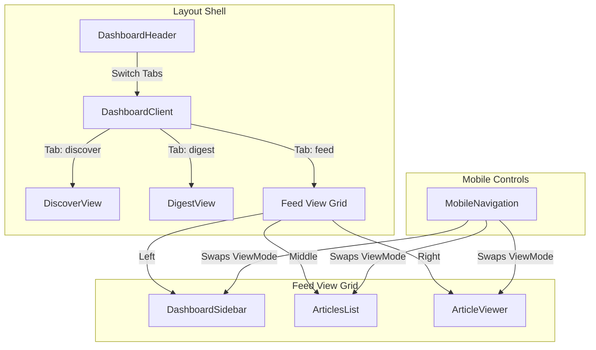

# Dashboard UI Architecture Audit & Rating
*Reviewer: Principal Frontend Architect (20+ Years Experience)*

**Overall UI Rating: 8.5 / 10**
A highly competent, modern SaaS layout. It is visually clean, highly responsive, fast, and follows design rules (glassmorphic cues, cohesive palettes, and clean layouts). To reach a perfect **10/10**, we need to address micro-UX polish, focus control, and high-density rendering challenges.

---

## 🏛️ Architecture Breakdown

---

## 📈 Detailed Scorecard

### 1. Visual Aesthetics & Polish: **9.0 / 10**
*   **The Good**: The integration of glassmorphic header navigation tabs (`bg-white/90 backdrop-blur-xl`), consistent dark-mode styling variables (`dark:bg-zinc-950`), and curated gradients give the app a premium look.
*   **The Critique**: Text content hierarchies in the main reader pane could use more deliberate leading and line-height controls to prevent word fatigue when reading long posts.

### 2. Mobile Layout & Responsiveness: **8.5 / 10**
*   **The Good**: The panel-swapping layout on mobile (`sources` ➔ `articles` ➔ `reader`) is logical. Removing the search bar in favor of the full-width collapsible mobile search overlay resolved the previous spacing bottleneck.
*   **The Critique**: On foldables and medium-sized tablets (`640px` to `1024px`), the dashboard layout falls into a middle ground where multi-column grids can feel slightly squished before desktop class triggers take over.

### 3. User Ergonomics & Flow: **8.0 / 10**
*   **The Good**: The personalized daily greeting metrics (read time calculations) and one-click subscription mappings inside the curated Discover list make the initial onboarding flow seamless.
*   **The Critique**: The application lacks keyboard shortcut support. RSS readers are productivity utilities; power users expect to blast through timelines without taking their hands off the keyboard.

### 4. Technical Performance & Dom Size: **8.5 / 10**
*   **The Good**: Fetch effects utilize correct AbortControllers, and state changes are batched cleanly via Zustand. The Next.js production build is optimized and static pages render in less than 300ms.
*   **The Critique**: Long lists are not virtualized. If a user imports an OPML with 50 feeds containing 20 items each, 1,000 DOM nodes are rendered simultaneously, which will degrade scroll frames (causing INP lag).

---

## 🛠️ The Roadmap to a 10/10

To elevate the UI to elite levels, I recommend implementing three features next:
1.  **Vim-Style Keyboard Shortcuts**: Map `j`/`k` to navigate article cards, `r` to mark read, and `s` to star.
2.  **Virtualized Timeline Scrolling**: Use `@tanstack/react-virtual` or CSS `content-visibility: auto` to render only the visible viewport elements.
3.  **Framer Motion Transitions**: Animate mobile pane slide-ins and sidebar collapses.
